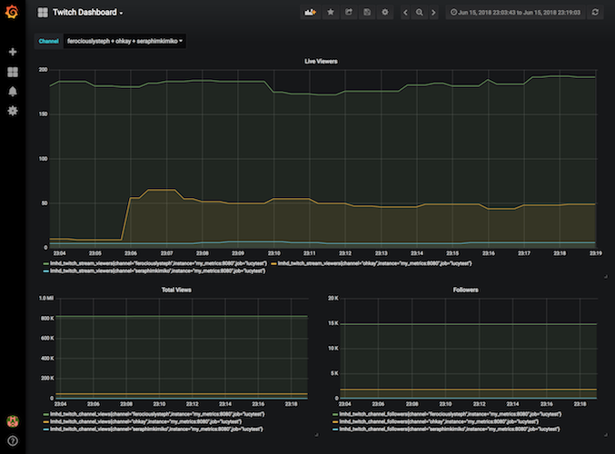

# Prometheus Exporter for the Twitch.tv API

Proof of Concept, using (deprecated) v5 (Kraken) Twitch API


## Usage

Copy `example.env` to `.env`, and modify as necessary:

| Variable           | What it does                                                                    |
|--------------------|---------------------------------------------------------------------------------|
| `LOG_LEVEL`        | Log verbosity of the exporter. Options are: debug, info, warn, error            |
| `KRAKEN_CLIENT_ID` | Twitch API Client ID  You can get one from https://glass.twitch.tv/console/apps |
| `TWITCH_CHANNELS`  | Comma-separated list of Twitch channels to monitor                              |

### Local

Run locally with:

```
go run *.go
```

### Docker

Launch the exporter, as well as a prometheus instance with:

```
docker-compose up -d
```

Prometheus will be available, on [http://localhost:9090](http://localhost:9090)

The docker-compose file also comes with Grafana, with a pre-configured dashboard, on [http://localhost:3000](http://localhost:3000) (username/password: admin/foobar)



If you want to add more channels, just modify `.env`, and reload the exporter with:

```
docker-compose up -d twitch_exporter
```


## TODO

- [ ] Migrate to the new (Helix) Twitch API
  - Helix should already provide most, if not all, of the necessary functionality, so migrate to that at some point
  - https://github.com/nicklaw5/helix

- [X] Bundle prometheus and grafana configs up into docker images

- [X] Automate builds

- [ ] Track followers for non-live channels (less frequently)

- [ ] Track how viewers are subs, followers, regulars, first time, etc. if possible

- [ ] Run this somewhere. ECS?


## If you want to support me making silly things
https://ko-fi.com/lucydavinhart
